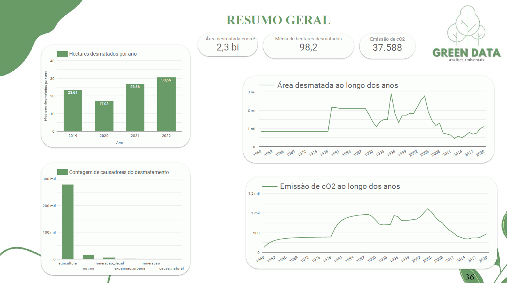

# 🌳 Análise de Desmatamento e Emissões de CO₂ na Amazônia  

**Bootcamp Analista de Dados – Soulcode Academy**  
*Projeto Final | Equipe Green Data*  

---

## 🎯 Objetivo  
Este projeto analisou dados de desmatamento e emissões de CO₂ na Amazônia, utilizando datasets do **[INPE](https://www.inpe.br/)** e **[MapBiomas](https://mapbiomas.org/)**. Como equipe, desenvolvemos um pipeline completo de dados, desde a extração e transformação (ETL) até a geração de dashboards interativos, com foco em:  
- Identificar **padrões de desmatamento** por estado e causa.  
- Correlacionar **emissões de CO₂** com áreas degradadas.  
- Propor soluções sustentáveis baseadas em dados.  

---

## 📊 Principais Conclusões  
### 🔥 Desmatamento  
- **Pará** lidera o desmatamento nacional, representando **~30%** da área total desmatada.  
- **Agricultura** é responsável por **>90%** dos casos registrados.  
- Queda de **17%** em hectares desmatados em 2020, seguida por aumento de **22%** em 2021.  

### 🌫️ Emissões de CO₂  
- Picos de emissões coincidem com períodos de **desmatamento acelerado**.  
- **Degradação florestal** contribui com **40%** das emissões secundárias.  

---

## 🚀 Sugestões de Ação  
- 🌱 **Parcerias com ONGs** para monitoramento em tempo real de áreas críticas.  
- ♻️ **Campanhas de reciclagem** direcionadas a comunidades agrícolas.  
- 📜 **Apoio a leis** que vinculem licenças agrícolas à preservação.  
- 🏭 **Armazenamento de CO₂** em formações geológicas subterrâneas.  
- 🌍 **Transição gradual** para operações carbono neutro.  

---

## 🛠️ Tecnologias Utilizadas  
| **Categoria**       | **Ferramentas**                                                                 |  
|----------------------|---------------------------------------------------------------------------------|  
| **Processamento**    | `Python` `Pandas` `PySpark` `NumPy`                                             |  
| **Armazenamento**    | `Google Cloud (GCP)` `MongoDB` `BigQuery`                                       |  
| **Visualização**     | `Power BI` `Matplotlib` `Seaborn` `Looker Studio`                                              |  

---

## 📈 Dashboard  

  

---

## 👥 Equipe  
| Camila Barcellos | **Camylla Oliveira** | Ester Beatriz |  
| Heloisa Gasques | Maria Eduarda Klug | Vanessa Monteiro |  

---

